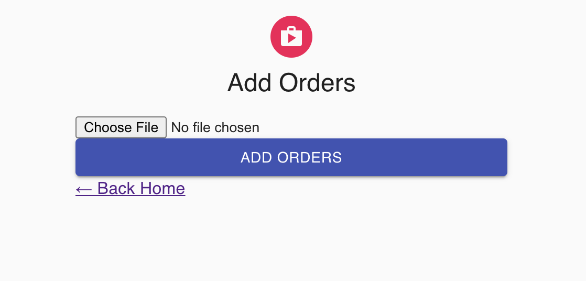
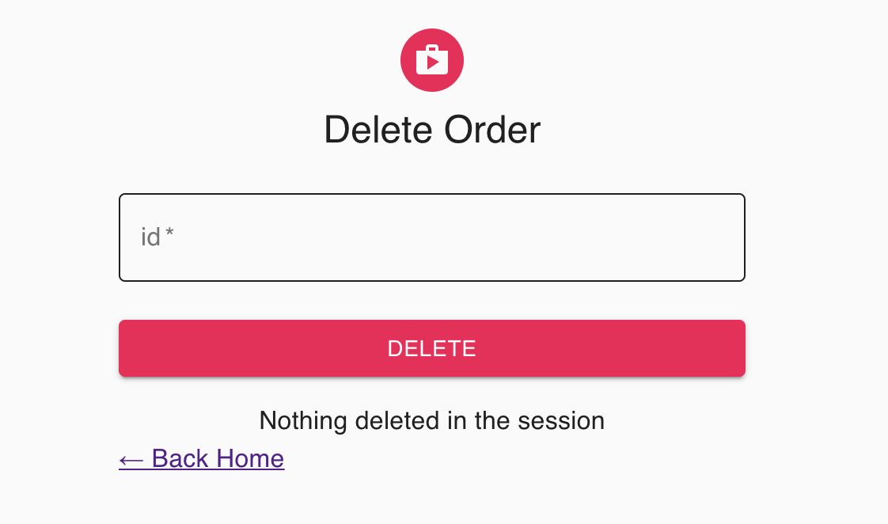
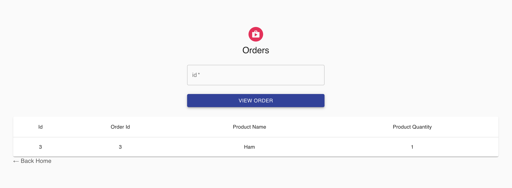
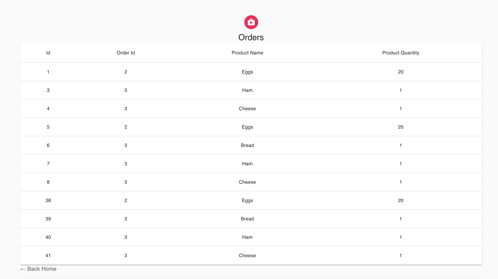

# LLRaftChallenge
Raft code challenge.

# Dependencies

1. **Download and install Docker**
	https://www.docker.com/products/docker-desktop

2. **Download and install Git**
	https://git-scm.com/downloads


## Steps to run docker container for the RAFT challenge

1. **Clone the application**

	```bash
	git clone https://github.com/luislahoz/LLRaftChallenge.git
	cd LLRaftChallenge
	```
2. **Run the App**
	You can run the app by typing the following command -

	```bash
	docker compose up
	```

	Frontend, Backend and database will run automatically, 

3. **How to access the running app**
	The front-end server will start on port `3000`.
	Open [http://localhost:3000](http://localhost:3000) to view it in the browser.


## How to use the RAFT challenge app

The home screen will show multple selections


Add Order view, here the user can add a txt file with orders.
Just click on `Choose File` select the file that contains the orders and then click on `Add Orders`.
The format of the file will be: `<order_id> | <product_name> | <product_quantity>`. Example: `2 | Eggs | 20`


Delete view, here the user can delete orders, one at a time, the user needs to provide the item id.
Just type the id and click `Delete`


View order, here the user can view an order, one at a time, the user needs to provide the item id.


